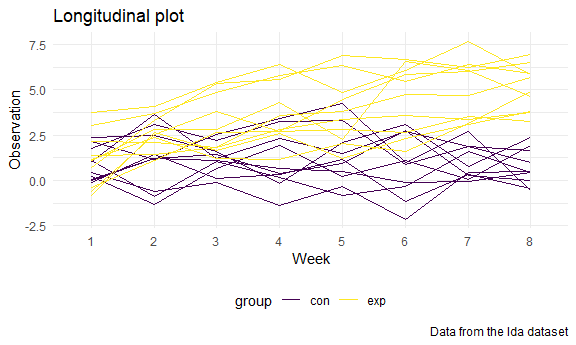
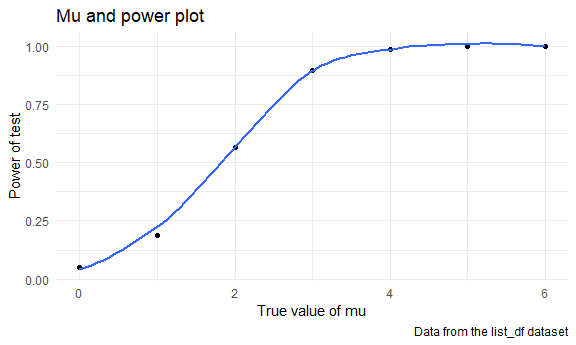
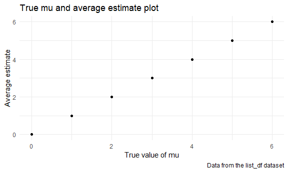
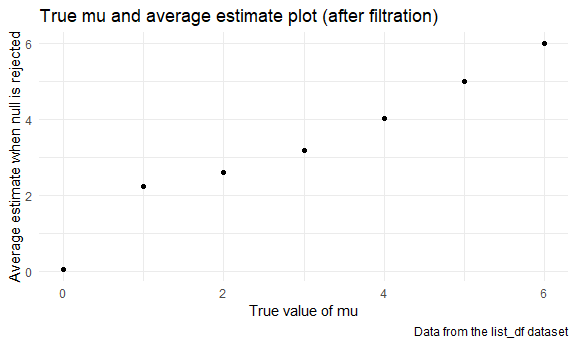

Homework 5
================
Clare Qian

## Problem 1

Read in the data.

``` r
homicide_df =
  read_csv("homicide_data/homicide-data.csv") %>%
  mutate(
    city_state = str_c(city, state, sep = "_"),
    resolved = case_when(
      disposition == "Closed without arrest" ~ "unsolved",
      disposition == "Open/No arrest"        ~ "unsolved",
      disposition == "Closed by arrest"      ~ "solved"
    )
  ) %>%
  select(city_state, resolved) %>%
  filter(city_state != "Tulsa_AL")
```

    ## Parsed with column specification:
    ## cols(
    ##   uid = col_character(),
    ##   reported_date = col_double(),
    ##   victim_last = col_character(),
    ##   victim_first = col_character(),
    ##   victim_race = col_character(),
    ##   victim_age = col_character(),
    ##   victim_sex = col_character(),
    ##   city = col_character(),
    ##   state = col_character(),
    ##   lat = col_double(),
    ##   lon = col_double(),
    ##   disposition = col_character()
    ## )

Let’s look at this a bit.

``` r
aggregate_df =
  homicide_df %>%
  group_by(city_state) %>%
  summarize(
    hom_total = n(),
    hom_unsolved = sum(resolved == "unsolved")
  )
```

    ## `summarise()` ungrouping output (override with `.groups` argument)

``` r
prop.test(
  aggregate_df %>% filter(city_state == "Baltimore_MD") %>% pull(hom_unsolved),
  aggregate_df %>% filter(city_state == "Baltimore_MD") %>% pull(hom_total)) %>%
  broom::tidy()
```

    ## # A tibble: 1 x 8
    ##   estimate statistic  p.value parameter conf.low conf.high method    alternative
    ##      <dbl>     <dbl>    <dbl>     <int>    <dbl>     <dbl> <chr>     <chr>      
    ## 1    0.646      239. 6.46e-54         1    0.628     0.663 1-sample~ two.sided

Try to iterate.

``` r
results_df = 
  aggregate_df %>%
  mutate(
    prop_tests = map2(.x = hom_unsolved, .y = hom_total, ~prop.test(x = .x, n = .y)),
    tidy_tests = map(.x = prop_tests, ~broom::tidy(.x))
  ) %>%
  select(-prop_tests) %>%
  unnest(tidy_tests) %>%
  select(city_state, estimate, conf.low, conf.high)
```

``` r
results_df %>%
  mutate(city_state = fct_reorder(city_state, estimate)) %>%
  ggplot(aes(x = city_state, y = estimate)) +
  geom_point() +
  geom_errorbar(aes(ymin = conf.low, ymax = conf.high)) +
  theme(axis.text.x = element_text(angle = 90, vjust = 0.5, hjust = 1))
```


## Problem 2

Import and tidy the dataset.

``` r
lda_df = 
  tibble(
    path = list.files("lda_data")
  ) %>%
  mutate(
    data = map(.x = str_c("lda_data/", path), ~read_csv(.x))
  ) %>%
  unnest(data) %>%
  mutate(
    path = substr(path, 0, 6),
    group = substr(path, 0, 3),
    sub_id = substr(path, 5, 6)) %>%
  select(path, group, sub_id, week_1:week_8) %>%
  pivot_longer(
    week_1:week_8,
    names_to = "week",
    values_to = "observation"
  ) %>%
  mutate(week = substr(week, 6, 7))
```

    ## Parsed with column specification:
    ## cols(
    ##   week_1 = col_double(),
    ##   week_2 = col_double(),
    ##   week_3 = col_double(),
    ##   week_4 = col_double(),
    ##   week_5 = col_double(),
    ##   week_6 = col_double(),
    ##   week_7 = col_double(),
    ##   week_8 = col_double()
    ## )
    ## Parsed with column specification:
    ## cols(
    ##   week_1 = col_double(),
    ##   week_2 = col_double(),
    ##   week_3 = col_double(),
    ##   week_4 = col_double(),
    ##   week_5 = col_double(),
    ##   week_6 = col_double(),
    ##   week_7 = col_double(),
    ##   week_8 = col_double()
    ## )
    ## Parsed with column specification:
    ## cols(
    ##   week_1 = col_double(),
    ##   week_2 = col_double(),
    ##   week_3 = col_double(),
    ##   week_4 = col_double(),
    ##   week_5 = col_double(),
    ##   week_6 = col_double(),
    ##   week_7 = col_double(),
    ##   week_8 = col_double()
    ## )
    ## Parsed with column specification:
    ## cols(
    ##   week_1 = col_double(),
    ##   week_2 = col_double(),
    ##   week_3 = col_double(),
    ##   week_4 = col_double(),
    ##   week_5 = col_double(),
    ##   week_6 = col_double(),
    ##   week_7 = col_double(),
    ##   week_8 = col_double()
    ## )
    ## Parsed with column specification:
    ## cols(
    ##   week_1 = col_double(),
    ##   week_2 = col_double(),
    ##   week_3 = col_double(),
    ##   week_4 = col_double(),
    ##   week_5 = col_double(),
    ##   week_6 = col_double(),
    ##   week_7 = col_double(),
    ##   week_8 = col_double()
    ## )
    ## Parsed with column specification:
    ## cols(
    ##   week_1 = col_double(),
    ##   week_2 = col_double(),
    ##   week_3 = col_double(),
    ##   week_4 = col_double(),
    ##   week_5 = col_double(),
    ##   week_6 = col_double(),
    ##   week_7 = col_double(),
    ##   week_8 = col_double()
    ## )
    ## Parsed with column specification:
    ## cols(
    ##   week_1 = col_double(),
    ##   week_2 = col_double(),
    ##   week_3 = col_double(),
    ##   week_4 = col_double(),
    ##   week_5 = col_double(),
    ##   week_6 = col_double(),
    ##   week_7 = col_double(),
    ##   week_8 = col_double()
    ## )
    ## Parsed with column specification:
    ## cols(
    ##   week_1 = col_double(),
    ##   week_2 = col_double(),
    ##   week_3 = col_double(),
    ##   week_4 = col_double(),
    ##   week_5 = col_double(),
    ##   week_6 = col_double(),
    ##   week_7 = col_double(),
    ##   week_8 = col_double()
    ## )
    ## Parsed with column specification:
    ## cols(
    ##   week_1 = col_double(),
    ##   week_2 = col_double(),
    ##   week_3 = col_double(),
    ##   week_4 = col_double(),
    ##   week_5 = col_double(),
    ##   week_6 = col_double(),
    ##   week_7 = col_double(),
    ##   week_8 = col_double()
    ## )
    ## Parsed with column specification:
    ## cols(
    ##   week_1 = col_double(),
    ##   week_2 = col_double(),
    ##   week_3 = col_double(),
    ##   week_4 = col_double(),
    ##   week_5 = col_double(),
    ##   week_6 = col_double(),
    ##   week_7 = col_double(),
    ##   week_8 = col_double()
    ## )
    ## Parsed with column specification:
    ## cols(
    ##   week_1 = col_double(),
    ##   week_2 = col_double(),
    ##   week_3 = col_double(),
    ##   week_4 = col_double(),
    ##   week_5 = col_double(),
    ##   week_6 = col_double(),
    ##   week_7 = col_double(),
    ##   week_8 = col_double()
    ## )
    ## Parsed with column specification:
    ## cols(
    ##   week_1 = col_double(),
    ##   week_2 = col_double(),
    ##   week_3 = col_double(),
    ##   week_4 = col_double(),
    ##   week_5 = col_double(),
    ##   week_6 = col_double(),
    ##   week_7 = col_double(),
    ##   week_8 = col_double()
    ## )
    ## Parsed with column specification:
    ## cols(
    ##   week_1 = col_double(),
    ##   week_2 = col_double(),
    ##   week_3 = col_double(),
    ##   week_4 = col_double(),
    ##   week_5 = col_double(),
    ##   week_6 = col_double(),
    ##   week_7 = col_double(),
    ##   week_8 = col_double()
    ## )
    ## Parsed with column specification:
    ## cols(
    ##   week_1 = col_double(),
    ##   week_2 = col_double(),
    ##   week_3 = col_double(),
    ##   week_4 = col_double(),
    ##   week_5 = col_double(),
    ##   week_6 = col_double(),
    ##   week_7 = col_double(),
    ##   week_8 = col_double()
    ## )
    ## Parsed with column specification:
    ## cols(
    ##   week_1 = col_double(),
    ##   week_2 = col_double(),
    ##   week_3 = col_double(),
    ##   week_4 = col_double(),
    ##   week_5 = col_double(),
    ##   week_6 = col_double(),
    ##   week_7 = col_double(),
    ##   week_8 = col_double()
    ## )
    ## Parsed with column specification:
    ## cols(
    ##   week_1 = col_double(),
    ##   week_2 = col_double(),
    ##   week_3 = col_double(),
    ##   week_4 = col_double(),
    ##   week_5 = col_double(),
    ##   week_6 = col_double(),
    ##   week_7 = col_double(),
    ##   week_8 = col_double()
    ## )
    ## Parsed with column specification:
    ## cols(
    ##   week_1 = col_double(),
    ##   week_2 = col_double(),
    ##   week_3 = col_double(),
    ##   week_4 = col_double(),
    ##   week_5 = col_double(),
    ##   week_6 = col_double(),
    ##   week_7 = col_double(),
    ##   week_8 = col_double()
    ## )
    ## Parsed with column specification:
    ## cols(
    ##   week_1 = col_double(),
    ##   week_2 = col_double(),
    ##   week_3 = col_double(),
    ##   week_4 = col_double(),
    ##   week_5 = col_double(),
    ##   week_6 = col_double(),
    ##   week_7 = col_double(),
    ##   week_8 = col_double()
    ## )
    ## Parsed with column specification:
    ## cols(
    ##   week_1 = col_double(),
    ##   week_2 = col_double(),
    ##   week_3 = col_double(),
    ##   week_4 = col_double(),
    ##   week_5 = col_double(),
    ##   week_6 = col_double(),
    ##   week_7 = col_double(),
    ##   week_8 = col_double()
    ## )
    ## Parsed with column specification:
    ## cols(
    ##   week_1 = col_double(),
    ##   week_2 = col_double(),
    ##   week_3 = col_double(),
    ##   week_4 = col_double(),
    ##   week_5 = col_double(),
    ##   week_6 = col_double(),
    ##   week_7 = col_double(),
    ##   week_8 = col_double()
    ## )

Create a spaghetti plot for each subject.

``` r
lda_df %>%
  ggplot(aes(x = week, y = observation, group = path)) +
  geom_line(aes(color = group)) + 
  labs(
  title = "Longitudinal plot",
  x = "Week",
  y = "Observation",
  caption = "Data from the lda dataset"
  )
```



As observed in the plot, the observation values of subjects in the
experimental group were higher than those of subjects in the control
group. Additionally, the observation values of the experimental group
continued increasing in the 8-week period, while the data of the control
group were relatively stable during the 8-week period.

## Problem 3

Write the function that generate the normalization dataset and conduct
the t-test.

``` r
sim_mean_sd = function(n = 30, mu, sigma = 5) {
  sim_data = tibble(
    x = rnorm(n, mean = mu, sd = sigma)
  ) %>%
  t.test(alternative = "two.sided", mu = 0) %>%
  broom::tidy() %>%
  select(estimate, p.value)  
}
```

Write the simulation function.

``` r
sim_results = function(x) { 
  rerun(5000, sim_mean_sd(mu = x)) %>% 
  bind_rows()
}
sim_results(0)
```

    ## # A tibble: 5,000 x 2
    ##    estimate p.value
    ##       <dbl>   <dbl>
    ##  1    1.38   0.0845
    ##  2    0.526  0.513 
    ##  3    0.439  0.645 
    ##  4    0.786  0.404 
    ##  5    1.11   0.294 
    ##  6    1.79   0.0281
    ##  7   -1.31   0.137 
    ##  8    1.67   0.0931
    ##  9    1.45   0.0728
    ## 10   -0.675  0.511 
    ## # ... with 4,990 more rows

Map to all the values of mu and create a table.

``` r
list_df = 
  tibble(mu = 0:6,
         t_test = map(.x = mu, ~sim_results(.x))
  )
```

Calculate the proportions and average estimate of each mu.

``` r
summarize_fx = function(x){
  x %>%
    mutate(
      H0 = case_when(
        p.value < 0.05 ~ "rejected",
        p.value > 0.05 ~ "not rejected"
        )
    ) %>%
    summarize(
      null_reject = sum(H0 == "rejected"),
      prop = null_reject/5000,
      avg_est = mean(estimate)
  )
}
list_df =
  list_df %>%
  mutate(
    summarize_list = map(.x = t_test, ~summarize_fx(.x))
  ) %>%
  unnest(summarize_list)
```

Generate the first plot.

``` r
list_df %>%
  ggplot(aes(x = mu, y = prop)) +
  geom_point() +
  geom_smooth(se = FALSE) +
  labs(
  title = "Mu and power plot",
  x = "True value of mu",
  y = "Power of test",
  caption = "Data from the list_df dataset"
  )
```

    ## `geom_smooth()` using method = 'loess' and formula 'y ~ x'



Description: When the effect size increase, the power of test increase,
first fast and then slowly.

Generate the second plot.

``` r
list_df %>%
  ggplot(aes(x = mu, y = avg_est)) +
  geom_point() +
  labs(
  title = "True mu and average estimate plot",
  x = "True value of mu",
  y = "Average estimate",
  caption = "Data from the list_df dataset"
  )
```



Generate the third plot.

``` r
filter_fx = function(x){
   x %>%
    mutate(
      H0 = case_when(
        p.value < 0.05 ~ "rejected",
        p.value > 0.05 ~ "not rejected"
        )
    ) %>%
    filter(H0 == "rejected") %>%
    summarize(avg_est_fil = mean(estimate))
}

list_df %>%
  mutate(
    avg_list = map(.x = list_df$t_test, ~filter_fx(.x))
  ) %>%
  unnest(avg_list) %>%
  ggplot(aes(x = mu, y = avg_est_fil)) +
  geom_point() +
  labs(
  title = "True mu and average estimate plot (after filtration)",
  x = "True value of mu",
  y = "Average estimate when null is rejected",
  caption = "Data from the list_df dataset"
  )
```



Description: The sample average of μ (avg\_est\_fil) across tests for
which the null is rejected are not equal to the true value of μ,
especially when true mu = 0, 1, 2, and 3 in my simulations. When the
true mu is close to the null value 0, there are few datasets whose null
hypotheses were rejected. As a result, the sample size was small and
thus the difference between sample average estimate and true mu was
large.
